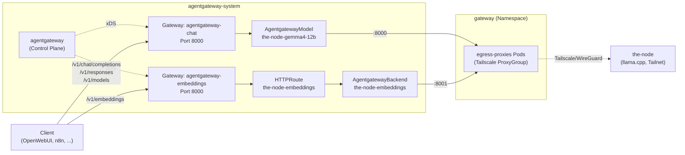

# agentgateway – Setup für `the-node`

Dieses Dokument beschreibt, wie der [agentgateway](https://agentgateway.dev) in diesem Cluster konfiguriert ist,
um Zugriff auf die LLM- und Embedding-Modelle von `the-node` (llama.cpp, per Tailscale erreichbar) bereitzustellen.

## Architekturüberblick



Zwei getrennte Gateways bedienen zwei getrennte Zwecke (siehe [Warum zwei Gateways](#warum-zwei-gateways) unten):

| Gateway | Zweck | Mechanismus | Adresse (in-cluster) |
|---|---|---|---|
| `agentgateway-chat` | Chat Completions + Responses API | `AgentgatewayModel` | `http://agentgateway-chat.agentgateway-system.svc.cluster.local:8000/v1` |
| `agentgateway-embeddings` | Embeddings | `HTTPRoute` + `AgentgatewayBackend` | `http://agentgateway-embeddings.agentgateway-system.svc.cluster.local:8000/v1/embeddings` |

## Ressourcen in diesem Namespace

| Datei | Enthält |
|---|---|
| [gateway-chat.yaml](gateway-chat.yaml) | `Gateway agentgateway-chat` + `AgentgatewayParameters agentgateway-chat-config` |
| [gateway-embeddings.yaml](gateway-embeddings.yaml) | `Gateway agentgateway-embeddings` + `AgentgatewayParameters agentgateway-embeddings-config` |
| [models-thenode.yaml](models-thenode.yaml) | `AgentgatewayModel the-node-gemma4-12b` (Chat-Modell) |
| [backend-thenode.yaml](backend-thenode.yaml) | `HTTPRoute` + `AgentgatewayBackend` für Embeddings |
| [the-node.enc.yaml](the-node.enc.yaml) | SOPS-verschlüsseltes `Secret the-node` (Authorization-Header für den Upstream-Server) |
| [values.yaml](values.yaml) | Helm-Values für die `agentgateway`/`agentgateway-crds` Charts (u.a. `agentgatewayModels.enabled: true`) |

Der eigentliche Netzwerkzugriff auf `the-node` läuft **nicht** über diesen Namespace, sondern über den
Tailscale-Egress im Namespace `gateway` (`clusters/homelab/infrastructure/gateway/`):
`proxy-node.yaml` (der `ExternalName`-Service), `allow-from-agentgateway.yaml` /
`allow-prometheus-scraping.yaml` (NetworkPolicies auf die tatsächlichen Proxy-Pods).

## Warum zwei Gateways

`AgentgatewayModel` ist eine experimentelle API, die pro Gateway-Listener ein einheitliches Modell-Routing (per
`model`-Feld im Request-Body statt per URL-Pfad) sowie ein automatisch generiertes `/v1/models` bereitstellt. Sie
muss über das Helm-Value `agentgatewayModels.enabled=true` freigeschaltet werden.

Sobald sie für einen Listener aktiv ist, übernimmt ein interner Resolver **global alle bekannten OpenAI-Pfade**
(`/v1/chat/completions`, `/v1/embeddings`, `/v1/responses`) auf diesem Listener — nicht nur die tatsächlich
registrierten Modelle. Ein `HTTPRoute`-basierter Embeddings-Pfad auf demselben Listener bricht dadurch, sobald
irgendein `AgentgatewayModel` dort registriert ist, weil `/v1/embeddings`-Requests dann zuerst vom Resolver
abgefangen und mit "Model not found" abgelehnt werden, statt zur `HTTPRoute` durchzufallen. `AgentgatewayModel`
selbst konnte für Embeddings (Custom-Provider) nicht zum Laufen gebracht werden — die Data-Plane bestand immer auf
dem Chat-Format. Die pragmatische Lösung: getrennte Gateways, damit sich beide Mechanismen nicht in die Quere
kommen.

## Bekannte Fallstricke

- **`AgentgatewayModel` ist experimentell** (`v1alpha1`, laut Doku "subject to change"). Für neue Modelle im
  Chat-Gateway: [models-thenode.yaml](models-thenode.yaml) als Vorlage nehmen.
- **Feldpfade sind nicht offensichtlich**: `AgentgatewayBackend.spec.policies.ai.modelAliases` und
  `...policies.ai.routes` (nicht `spec.policies.modelAliases`). Ohne `policies.ai.routes` interpretiert
  agentgateway jeden Request als Chat-Completions-Format (braucht `messages`), auch wenn der Provider z.B.
  `Embeddings`-Formate deklariert.
- **Tailscale-Egress-Ports sind nicht die Service-Ports**: Der Tailscale-Operator vergibt für jedes Egress-Ziel
  einen zufälligen internen Port (aktuell z.B. Service-Port 8000 → Pod-Port 10304), sichtbar in der ConfigMap
  `egress-proxies-egress-config` im `gateway`-Namespace. Das ist eine bekannte, ungelöste Einschränkung
  ([tailscale/tailscale#15759](https://github.com/tailscale/tailscale/issues/15759)) — NetworkPolicies dürfen sich
  deshalb nur auf die Quelle (Namespace/Pod-Label), nicht auf den Zielport verlassen.
- **`kubectl apply` kann bei mehrfach quergeschriebenen Objekten hängen bleiben** (`resourceVersion: Invalid value:
  0`) — in dem Fall hilft `kubectl apply --server-side --force-conflicts`.

## Nützliche Befehle

```bash
# Modelle, die der Chat-Gateway kennt
kubectl exec -n web-ui deploy/openwebui -- curl -s http://agentgateway-chat.agentgateway-system.svc.cluster.local:8000/v1/models

# Live-Request-Log mitlesen (zeigt Routing-Entscheidung, Provider, Tokens)
kubectl logs -n agentgateway-system deploy/agentgateway-chat -f
kubectl logs -n agentgateway-system deploy/agentgateway-embeddings -f

# Warum wurde ein AgentgatewayModel/-Backend nicht akzeptiert?
kubectl get agentgatewaymodel -n agentgateway-system <name> -o jsonpath='{.status}'
kubectl get agentgatewaybackend -n agentgateway-system <name> -o jsonpath='{.status}'

# Wird Traffic von einer NetworkPolicy verworfen? (Cilium)
kubectl exec -n kube-system <cilium-pod> -c cilium-agent -- hubble observe --namespace gateway --verdict DROPPED
```

---

## Wie die einzelnen Bausteine allgemein funktionieren

Dieser Abschnitt beschreibt die Konzepte unabhängig von diesem konkreten Setup — nützlich, wenn du einen neuen
Provider anbindest oder dieses Muster in einem anderen Cluster wiederverwendest.

### Gateway API (`Gateway`, `HTTPRoute`, `GatewayClass`)

Die [Kubernetes Gateway API](https://gateway-api.sigs.k8s.io/) ist der Nachfolger von `Ingress`, aufgeteilt nach
Verantwortlichkeit:

- **`GatewayClass`** (cluster-weit, von der Infrastruktur bereitgestellt): definiert, *welcher Controller*
  Gateways dieser Klasse verwaltet (hier: `agentgateway`).
- **`Gateway`**: eine konkrete Instanz — öffnet Listener (Port + Protokoll) und erzeugt dafür automatisch
  Deployment + Service. Legt fest, welche Route-Arten (`allowedRoutes.kinds`) und aus welchen Namespaces
  (`allowedRoutes.namespaces`) sich anhängen dürfen.
- **`HTTPRoute`**: hängt sich per `parentRefs` an einen `Gateway`-Listener und definiert Matching-Regeln (Pfad,
  Header, Methode) → Ziel-Backend. Ein `Gateway` kann mehrere `HTTPRoute`s aus verschiedenen Namespaces bedienen;
  das entkoppelt "wer betreibt den Eingang" von "wer definiert Routing-Regeln".

Der Vorteil gegenüber `Ingress`: herstellerübergreifende, typisierte Ressourcen statt Annotationen, und saubere
Trennung zwischen Infrastruktur-Betrieb (Gateway) und Team-spezifischem Routing (HTTPRoute).

### agentgateway als Gateway-API-Implementierung

agentgateway ist eine von mehreren möglichen Implementierungen der Gateway API (wie z.B. auch Envoy Gateway oder
Istio), spezialisiert auf KI-/Agenten-Traffic. Es besteht aus zwei Teilen:

- **Control Plane** (`agentgateway`-Deployment): beobachtet Kubernetes-Ressourcen (Gateway, HTTPRoute,
  AgentgatewayBackend, ...) und verteilt daraus generierte Konfiguration per xDS-Protokoll an die Data-Plane-Pods.
- **Data Plane** (ein eigenes Deployment *pro* `Gateway`-Objekt, z.B. `agentgateway-chat`): der tatsächliche Proxy,
  der Client-Requests annimmt, gegen die vom Control Plane gelieferte Konfiguration matcht und an Backends
  weiterleitet. Läuft komplett unabhängig vom Control Plane weiter, falls der kurzzeitig ausfällt.

### `AgentgatewayParameters`

Herstellerspezifische Erweiterung für Feineinstellungen an dem generierten Deployment/Service eines `Gateway`
(Replica-Anzahl, Service-Typ, Ressourcen-Limits, ...), referenziert über
`Gateway.spec.infrastructure.parametersRef`. Das ist der übliche Gateway-API-Mechanismus, um
implementierungsspezifische Optionen anzubieten, ohne den generischen `Gateway`-Typ zu verwässern.

### `AgentgatewayBackend`

Beschreibt *ein* Ziel für KI-Traffic: welcher Provider (OpenAI-kompatibel, Anthropic, Bedrock, ein selbstgehostetes
`custom`-Backend, ...), unter welchem Host/Port erreichbar, mit welcher Auth. Wird per `HTTPRoute` wie ein
normales Backend referenziert (`kind: AgentgatewayBackend` statt `kind: Service`). Das erlaubt es, an einem festen
URL-Pfad (z.B. `/v1/chat/completions`) beliebige Provider anzuschließen, unabhängig davon, wie der jeweilige
Provider intern tatsächlich heißt oder erreichbar ist — der Client sieht immer dieselbe OpenAI-kompatible
Oberfläche.

`spec.policies.ai.modelAliases` erlaubt es, einen client-seitigen Modellnamen auf den tatsächlichen
Provider-Modellnamen abzubilden. `spec.policies.ai.routes` legt fest, welches Request-*Format* (Completions,
Embeddings, Responses, ...) für welchen Pfad erwartet wird — ohne das defaultet alles auf Chat-Completions.

### `AgentgatewayModel`

Höherwertige, modell-zentrierte Alternative zu `AgentgatewayBackend` + `HTTPRoute`: statt Requests anhand des
URL-Pfads zu routen, matched `AgentgatewayModel` anhand des `model`-Felds im Request-Body (`spec.match.model`,
mit Wildcard-Unterstützung wie `openai/*`). Mehrere `AgentgatewayModel`s, die an denselben `Gateway` angehängt
sind, teilen sich eine gemeinsame Modell-Tabelle — daraus generiert agentgateway automatisch eine `/v1/models`-
Antwort. Damit lassen sich beliebig viele Provider/Modelle hinter *einer* Adresse bündeln, ohne dass Clients den
Pfad wechseln müssen. `spec.virtualModel` erlaubt zusätzlich Gewichtung/Failover/Bedingungen zwischen mehreren
konkreten Modellen. Diese API ist als `v1alpha1` gekennzeichnet und laut Doku "subject to change".

### `AgentgatewayPolicy`

Cross-cutting Verhalten (Auth, Header-Transformation, Rate-Limiting, Retries, ...), per `targetRefs` an ein
`Gateway`, `HTTPRoute` oder `AgentgatewayBackend` angehängt. Die Phase (`PreRouting` vs. `PostRouting`) bestimmt,
ob eine Policy *vor* der Routing-Entscheidung greift (z.B. um Header aus dem Body zu extrahieren, die dann fürs
Matching gebraucht werden) oder danach (z.B. um die Antwort zu transformieren).

### Tailscale Kubernetes Operator (Egress)

Ein `Service` vom Typ `ExternalName` mit den Annotationen `tailscale.com/tailnet-fqdn` und
`tailscale.com/proxy-group` weist den Tailscale-Operator an, Traffic zu diesem Servicenamen an ein Gerät im
Tailnet weiterzuleiten. Die eigentliche Arbeit übernehmen die Pods der referenzierten `ProxyGroup`
(`type: egress`) — sie bauen die WireGuard-Verbindung ins Tailnet auf und nehmen lokal auf einem *zufällig
zugewiesenen* Port Verbindungen entgegen, die sie dann zum Tailnet-Ziel weiterreichen. Mehrere Egress-Services
können sich eine `ProxyGroup` (und damit dieselben Pods) teilen; welcher Port zu welchem Ziel gehört, steht in
einer vom Operator verwalteten ConfigMap.

### Kubernetes `NetworkPolicy`

Ohne jede `NetworkPolicy` darf in Kubernetes jeder Pod jeden anderen Pod erreichen. Eine `NetworkPolicy` mit
`policyTypes: [Ingress]` schaltet für die von ihrem `podSelector` erfassten Pods auf "alles verboten außer
explizit erlaubt" um — und zwar nur für den erfassten Verkehrstyp (hier: eingehend). Mehrere `NetworkPolicy`-
Objekte mit demselben `podSelector` werden dabei mit ODER verknüpft (jede erlaubt zusätzlichen Traffic). Wichtige
Falle: stehen `namespaceSelector` und `podSelector` als zwei separate Einträge in derselben `from`-Liste, werden
sie mit ODER statt UND verknüpft ("dieser Namespace" *oder* "dieser Pod-Name irgendwo", nicht "dieser Pod-Name in
diesem Namespace"). Für ein UND müssen beide Selektoren im selben Listeneintrag stehen (wie in
`allow-from-agentgateway.yaml`).
